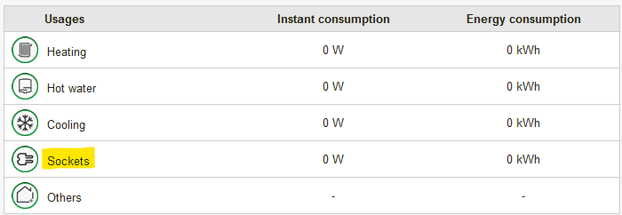

# Wiser EM5 + HomeAssistant
Connect your Schneider Electric Wiser EM5 energy meter to HomeAssistant!

<font size="7">

Local integration without cloud. Also compatible with Clipsal products (Australian market rebranding).

## Compatible hardware

This guide can be used to connect the following hardware to HomeAssistant:

- a compatible energy meter:
   - Schneider Electric **Wiser EM5** / RT2012 Energy Meter / **EER39000** / **EER39100**
   - Clipsal **Wiser Link EM5** / **EER71000** / **EER71100**

 

[ℹ️ Schneider Electric Wiser EM5 documentation](docs/S1B65431-04.pdf)

[ℹ️ Clipsal Wiser Link EM5 documentation](docs/W0001723.PDF)

- a compatible Ethernet gateway:
   - Schneider Electric **Wiser MIP** / IP Communication Module / **EER31600**
   - Clipsal **Wiser Link MIP** / IP Communication Module / **EER70600**

 

[ℹ️ Schneider Electric Wiser MIP EER31600 documentation](docs/S1B66612-00.pdf)

[ℹ️ Clipsal Wiser Link MIP EER70600 documentation](docs/W0001725.PDF)

Note: The Wiser EM5 energy meter can also be linked to the newer Schneider Electric **EER31800** / Clipsal **EER72600** Wiser IP module, but this gateway does not offer an easy way to get Wiser EM5 data for now.
If you want to connect your Wiser EM5 energy meter to HomeAssistant, I strongly suggest you to use the Schneider Electric EER31600 / Clipsal EER70600 Wiser MIP gateway.
You can find a second-hand / refurbished model online.


## Wiring diagram

[Follow the wiring diagram from the Wiser EM5 official documentation](docs/S1B65431-04.pdf)

Connect the Wiser IP module to your router (DHCP recommended).

For the Schneider Electric EM5 model, you can ignore the  /  /  symbols on the tor/clamps connectors and monitor any power source.
Keep in mind you can connect up to 2 tor/clamps on each EM5 input.

Note: Your Wiser EM5 cannot be connected to the Wiser Wall Display EER22000. If you have a Wiser Wall Display, you need to disonnect it from the EM5 to connect the Wiser MIP instead.


After wiring, you should be able to access the Wiser MIP web portal using its IP address (default login is admin/admin).
If not, reset the Wiser MIP (15 seconds press on front button then release, Status LED should turn red, wait for Status LED green again)


Under "Device Status" > "MIP" the EM5 connection should be enabled and working:


Ignore the "Wiser Link Internet connection", it will not work because the EER31600 has been discontinued and cloud access is disabled.

## Firmware update (optional)

### Latest publicly available firmware version:
- Schneider Electric Wiser EM5 (all versions): **1.6.00**
- Schneider Electric Wiser MIP (EER31600): **V1.3.8**
- Clipsal EM5 / MIP : **unknown**

### Do I need to update?

**Firmware updates are not needed for Clipsal products.**

Firmware updates for Schneider Electric Wiser EM5 & Wiser MIP EER31600 are needed only if you want to monitor each of the 5 EM5 tor/clamps input separately:

If you have a recent Schneider Electric Wiser EM5 (or a Clipsal Wiser EM5), this might already be the case.


For older Wiser EM5, because they were originally developed as french RT2012 energy meters, the 2 electrical plugs input  cannot be monitored separately.
This means you have only 4 measurements available :



If you want to monitor 5 separate tor/clamps input, you need to update the firmware.

### Update procedure

Firmware updates are made through the Schneider Electric eSetup application.

Because the Wiser MIP EER31600 is no longer maintained, it is not possible to update it with the latest eSetup app anymore.

The recommended way is to download and install an older version of the eSetup app like [eSetup for Android 6.2.0](https://github.com/mathoudebine/homeassistant-wiser-em5/raw/refs/heads/main/app/eSetup_for_Electrician_6.2.0.apk)

Open the app and select "Wiser IP Module".


You should see your Wiser MIP on the list if your smartphone is connected to the same network. Select it.


A message should state that your firmware is not up-to-date. Click on the "Update" button.


Wait for the update procedure to finish. 
- **Do not exit the eSetup app!**
- **Ensure the smartphone has enough battery or plug it to a power source!**
- **Update can take up to 30 minutes if your Wiser EM5 is also updated (shorter of only the Wiser MIP is updated).**


Once the update is done, the EM5 and MIP will reboot. After reboot, open eSetup app again and select your MIP. The update message should no longer be displayed.


If the update fails:
- reset the Wiser MIP (15 seconds press on front button then release, Status LED should turn red, wait for Status LED green again) then try to update again
- keep the smartphone in a place with good Wi-Fi signal
- plug the smartphone to a power source
- disable the smartphone auto sleep / screen off

## HomeAssistant integration

There is no need for a custom component to integrate the Wiser EM5 & MIP to HomeAssistant.
Instead, the Wiser MIP offers a RestAPI access containing all the EM5 energy metering data, like it is displayed on the MIP web server.

HomeAssistant uses the [RESTful integration](https://www.home-assistant.io/integrations/rest/) to collect data from RestAPI endpoints and create sensors from it.

The RESTful integration cannot be configured from HomeAssistant UI but only manually: 
Edit your `configuration.yaml`, e.g. using an add-on like [File Editor](https://github.com/home-assistant/addons/tree/master/configurator) or [Studio Code Server](https://github.com/hassio-addons/addon-vscode).
Find the `rest:` section inside the file, it it does not exist then create a new one at the end of the file then add the following content:
```yaml
rest:
  # REST Sensors for Wiser MIP
  - !include rest_wiser_mip.yaml
```

Save the file, then create a new file `rest_wiser_mip.yaml` in the same folder.
Edit this file and add the following content: [rest_wiser_mip.yaml](rest_wiser_mip.yaml).
Restart HomeAssistant to reload the configuration.

Energy (kWh) & Power (W) data will be fetched from your Wiser MIP and imported to HomeAssistant for the following EM5 inputs:
- the 5 EM5 tor/clamps  (inputs 7 to 16)
- the EM5 TIC Télé-Information Client - not available on Clipsal models, only for the french market energy counter
- the "others" which is a simple substraction between the TIC input and the sum of all tor/clamps inputs
